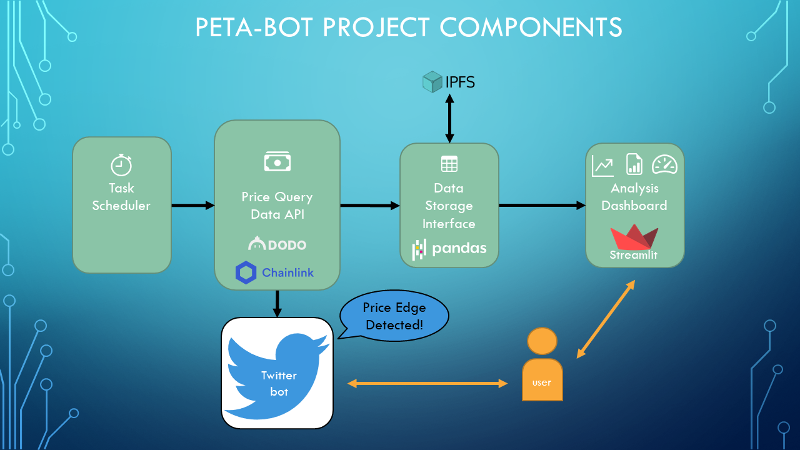
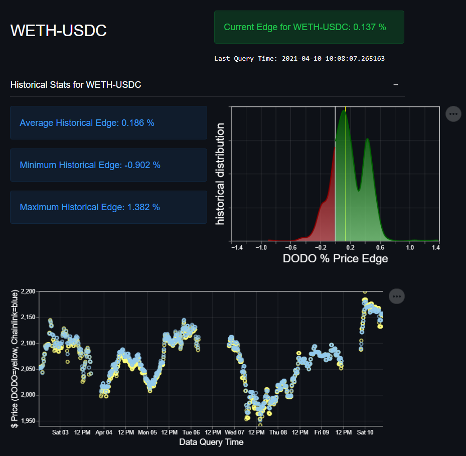

# ChainlinkHackathon2021
#chainlink

PETA-Bot

Price Edge & Twitter Analysis Bot (PETA-Bot)

  

## Intro
This project was started for the chainlink 2021 hackathon as my first foray into ethereum, smart contracts, and chainlink.

The code contains queries for generating price quotes from different exchanges, including DODO and chainlink data oracles. 

When there is a price advantage, the twitter bot will tweet out the currency pair and the price edge. 

Previous price data and opportunities are tracked in an interactive dashboard, powered by streamlit.

## Code Outline
The project was written making use of 3rd party python libraries, including web3.py, tweepy.py, and streamlit.py.

I used web3.py to interact with the chainlink price feed smart contracts on the mainnet, and to query the midprice data using the DODO exchange smart contract on the mainnet. I used tweepy to interact with the twitter api and drive the [Twitter Bot](https://twitter.com/DodoPetaBot), and I used the streamlit framework, along with some scipy statistics functions, as the bones for the historical data analytics dashboard app. The historical database is accessed using the python pandas dataframe objects, and for short term queries, is stored in local csv files. At longer term intervals, the historical data is backed up to the IPFS, under a constant IPNS name reference.

The main driving module is the PetaBotDriver.py. This module schedules price queries at a specified time interval (defaults to every 30 minutes). Once the price is queried for 8 different currency pairs on both the chainlink mainnet price feed, as well as on the DODO price feed, the data is appended to the historical price data database. 

## How to run 

Make sure you have a recent version of python installed on your machine.

Create a new directory on your local computer and cd into it. 
>mkdir petabot-project

>cd petabot-project

Create a folder called 'repo' inside the main petabot-project directory:
>mkdir repo

Clone this github repo into your local "repo" folder.

Go up one directory level into the main petabot-project folder:
>cd ..

Add two .json files that will store your own credential information for your twitter account and for your infura account, and call them secretTwitterCredentials.json and secretInfuraCredentials.json, respectively:

The secretTwitterCredentials.json file should contain the following:

{"APP_KEY":"\<YOUR TWITTER APP KEY HERE\>",

 "APP_SECRET":"\<YOUR TWITTER SECRET APP KEY HERE\>",
 
 "OAUTH_TOKEN":"\<YOUR TWITTER OAUTH TOKEN HERE\>"
 
 "OAUTH_TOKEN_SECRET":"\<YOUR TWITTER SECRET OATH TOKEN  HERE\>"
 
 "BEARER_TOKEN":"\<YOUR TWITTER BEARER TOKEN HERE\>"}

The secretInfuraCredentials.json file should contain the following:

{"PROJECT_ID":"\<YOUR INFURA PROJECT ID HERE\>",

 "PROJECT_SECRET":"\<YOUR SECRET INFURA PROJECT ID HERE\>",
 
 "KOVAN_ENDPOINT":"https://kovan.infura.io/v3/\<YOUR INFURA PROJECT ID HERE\>",
 
 "MAINNET_ENDPOINT":"https://mainnet.infura.io/v3/\<YOUR INFURA PROJECT ID HERE\>",
 
 "ROPSTEN_ENDPOINT":"https://ropsten.infura.io/v3/\<YOUR INFURA PROJECT ID HERE\>",
 
 "RINKEBY_ENDPOINT":"https://rinkeby.infura.io/v3/\<YOUR INFURA PROJECT ID HERE\>",
 
 "GOERLI_ENDPOINT":"https://goerli.infura.io/v3/\<YOUR INFURA PROJECT ID HERE\>"}
  
 So now, your directory structure should look like:
 

    petabot-project 
    
    |--secretTwitterCredentials.json
    
    |--secretInfuraCredentials.json
    
    |--repo
    
         |.git
         
         |...
 
 Now, you need to install all the python dependencies:
 
 >cd repo
 
 >pip install -r requirements.txt

This might take a little while. Once it is finished, you can finally view the analysis dashboard app:
 
 >streamlit run analysisDashboard.py

This will set up a local web server and open the app in a browser window. From there, enjoy!

To run the twitter bot, and to set the frequency of time at which the code will query the price feeds and update your local historical data, go to the repo folder and open the PetaBotDriver.py module in a python IDE, like spyder.

Run the module to load in the functions, and then run the main function in the module:

(python)>>> executePetaBotTasks(scheduler=s, timePeriod=60*30, pricePercentageTweetThreshold=0.1)

For as long as this python function runs, it will continue to schedule price query events every timePeriod seconds, and then tweet the results if the DODO price is lower than the chainlink pricefeed price by the percentage specified in the pricePercentageTweetThreshold input.

Note, the first time I started using the twitter bot, my twitter developer account got banned for breaking twitter rules. They never told me which rules I broke, but it might have had to do with trying to tweet too often. You should be able to adjust the timePeriod input to take care of this. :)

Enjoy!

### Note on hosted app
I have requested from streamlit's website that I be able to host the analysis dashboard app, but I am currently still on their waiting list for this. Once the app is hosted, anyone could interact with the tool and could use the data from IPFS. This, or hosting it myself on google cloud, will likely be a next step for the project.

## Summary
Follow our [Twitter Bot](https://twitter.com/DodoPetaBot)!

Like the PETA-Bot Projects? Consider Donating ETH!

0x2263B05F52e30b84416EF4C6a060E966645Cc66e
